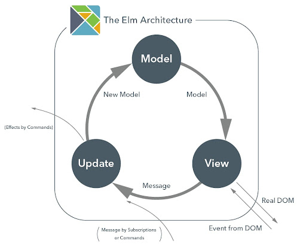
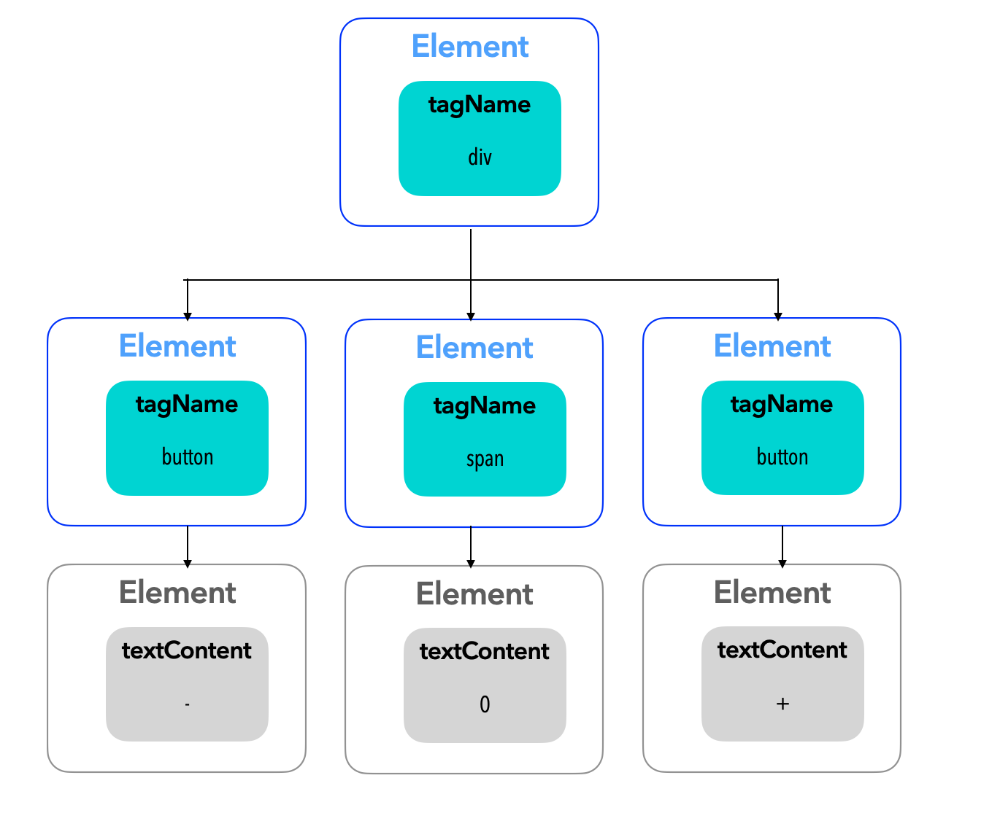

# Meet TEA : Everything start with a counter

Our firts task is to create a simple counter using TEA.

## React, Redux & cie

In The Elm Architecture, the data only goes one way. This is called the **one way data flow**.

To experiment TEA and the one way data flow, we will use [**Redux**](https://redux.js.org/).

> Redux is a lightweight state management tool for JavaScript applications, released in 2015 and created by Dan Abramov and Andrew Clark. It's the most popular state management solution and works well with React.

### Testing

To test our app, we will use [`fast-check`](https://github.com/dubzzz/fast-check) that implements Property Based Testing in Javascript. This is the same as [`QuickCheck`](https://hackage.haskell.org/package/QuickCheck-2.14.2/docs/Test-QuickCheck.html) in Haskell or [`Qcheck`](http://c-cube.github.io/qcheck/) in Ocaml.
As a reminder, Property Based Testing is used to test properties of an application. So it generate many inputs for your property and test if it verified. If all is ok, your test pass to green, else your test will be red and fast-check give you a minimal couterexample (it's call shrinking).

The tests are already implemented in `specs` folder. Your mission, if you accept it, is to make sure that all your tests turn green !
### How Redux works ?

On the top-level, we define a state which represents our model in our application.

Then, this state can be updated by function called reducer, which take the current value of the state and an action and return a new state updated with the action intention.

An action is a plain object which represents what we want to update in our global state.

Once the state is updated by the reducer, views affected by the update can be re-rendered.

An action can be dispatched by an user action or in response of another action.


To sum up :
- *Action* : plain object that represents an intention to change the state. (**Message in TEA**)
- *State* : application data model (**Model** in TEA)
- *Reducer* : pure function used to update the state (**Update in TEA**)
- *View* : user interface (**View in TEA**)

The Elm Architecture :




The Redux "one way dataflow" :


## Representing our application state

First point is to define the initial state of our application. In TEA we store the state in a `State` entity. For a counter its type will be a `number` (in Javascript world) and inital value `0`.


```ts
type State = {
  counter: number,
}

const defaultState: State = {
  counter: 0
}
```

## Handling events with messages and updates


Now we can represent the counter, we would like to provide buttons `-` and `+` to decrement or increment our state. We need to write an `update` function that translate _messages_ into the desired `state`. The  message  should  describe _what happened_.

In Redux world, the function `update` is called a `reducer` and the messages that carry our data is called an `action`.

A reducer is simply a function that take the current `state` and an `action` as arguments and return a new `state`. So a reducer is `(state, action) => newState`.
State  is updated according to the action in parameter.


Let's go to write our first reducer ! 🙂
First, we define our new types ...

```ts
type Increment = { type: 'INCREMENT' };
type Decrement = { type: 'DECREMENT' };

type Actions =
  | Increment
  | Decrement

```
... and then, write the reducer

```ts
const myReducer = (state: State | undefined, action: Actions) : State => {
  if (!state) return defaultState; // mandatory by redux
  switch (action.type) {
    case 'INCREMENT':
      return { ...state, counter: state.counter + 1};
    case 'DECREMENT':
      return { ...state, counter: state.counter - 1};
  }
}
```

> ℹ️ A Redux state is undefined when your app is starting. To build your initial state, Redux launch an action to initialize it. That's why in reducer our state is `State | undefined`.

> Another thing, in Typescript there are exhaustive switch statements and to take advantage of it, we need to delete the default case.

## Writing view function

### Expressive UI with functions

Browsers are translating HTML markup into a Document Object Model (a.k.a DOM) that represents the structure of the current page. The DOM consists of DOM nodes, and it’s only by changing these nodes that web applications can modify the current page.

The two most common types of DOM nodes are:
- _Elements_: These have a **tagName** (such as "button" or "div"), and may have child DOM nodes.
- _Text nodes_: These have a **textContent** property instead of a tagName, and are childless.

We want to display 2 buttons and a text:
```html
<div>
    <button> - </button>
    <span> 0 </span>
    <button> + </button>
</div>
```

This HTML produce the relative DOM:



With React, we usually use a syntax called JSX (_Javascript Syntax Expression) which provides syntactic sugar over our component code. This syntax is similar to XML. This syntactic sugar corresponds to functions for creating DOM elements. For example, this expression ...

```ts
<div>Hello {this.props.world}</div>
```

...corresponds to

```ts
React.createElement('div', null, `Hello ${this.props.world}`)
```

But it's for your culture, **only use JSX when writing components in React !!**

### The counter view

For this training we will use [styled-components](https://styled-components.com/) to quickly add theming. It provides a way to define components styled with CSS.
Let's go to define our style !


```ts
const Container = styled.div`
  padding: 16px;
  justify-content: center;
  display: flex;
`;

const Button = styled.button`
  padding: 16px 32px;
  background-color: indigo;
  color: white;
  font-weight: 600;
  box-shadow: 0 4px 6px -1px rgba(0, 0, 0, 0.1), 0 2px 4px -1px rgba(0, 0, 0, 0.06);
  border-radius: 8px;

  &:hover {
    background-color: #3c0068;
  }
  &:focus {
    background-color: #5e00a3;
  }
`;

const DisplayCounter = styled.span`
  padding: 16px 32px;
  margin-top: 8px;
  color: darkgrey;
`;
```


Then we can write our first component ! 🚀
```ts
const Counter = () => {
  const counter = useSelector(counterSelector);
  const dispatch = useDispatch();
  return (
    <Container>
      <Button onClick={() => dispatch(decrement())}> - </Button>
      <DisplayCounter>{counter}</DisplayCounter>
      <Button onClick={() => dispatch(increment())}> + </Button>
    </Container>
  );
};
```

To keep the app simple, we use Redux hooks `useSelector` and `useDispatch` :
- `useSelector` is used to get a value from Redux state
- `useDispatch` provides a way to dispatch an action

More informations [here](https://react-redux.js.org/api/hooks).


> ℹ️ Notice that `view` builds fresh HTML values after every update. That might sound like a lot of performance overhead, but in practice, it’s almost always a performance benefit!
This  is  because  React  doesn’t  actually  re-create  the  entire  DOM  structure  of  the page every time. Instead, it compares the HTML it got this time to the HTML it got last time and updates only the parts of the page that are different between the two requested representations.

> This approach to virtual  DOM  rendering was popularized by React and it has several benefits over manually altering individual parts of the DOM:
> - Updates are batched to avoid expensive repaints and layout reflows
> - Application state is far less likely to get out of sync with the page
> - Replaying application state changes effectively replays user interface changes
