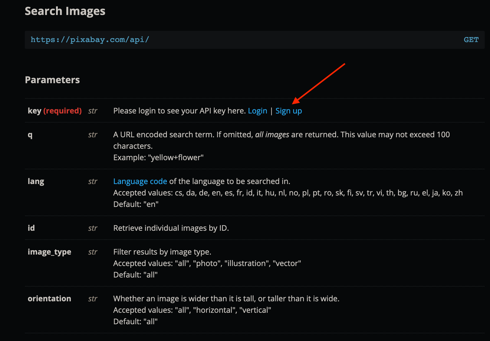

# Catstagram

We will build a thumnbail of cats pictures.

## 🔁 Iteration 1 : Fake data 🔁

We would like to display a thumbnail of pictures.

### US1 : Display the thumbnail

> AS a user
>
> I WANT to display a thumbnail of X pictures

> BUSINESS RULE: X = min(value of the counter, number of avalaible pictures)

## 🧑‍💻 Exercice 2: Implement US1 with fake datas 🧑‍💻

You can use this type with some fake datas :

```ts
export type Picture = {
  previewFormat: string;
  webformatFormat: string;
  author: string;
  largeFormat: string;
};
```
Type `Picture` is in this [file](../src/types/picture.type.ts)

Fake data are in [fake-datas.json](../src/fake-datas.json) file.

Your tasks:
- Update the **state type** and initial value to store an array of pictures (💡 Tip : [slice](https://developer.mozilla.org/en-US/docs/Web/JavaScript/Reference/Global_Objects/Array/slice))
- Update the **reducer** to update the array of pictures while updating the counter value (ex: if counter's value is 5 you must have 5 pictures)
- Update **pictures selector** to get pictures from state
- Update [pictures component](../src/components/pictures.tsx) to display the pictures in `previewFormat`.
### US2 : Manage the popover

> AS a user
>
> WHEN I click on a picture
>
> I WANT to display a modal with large picture, info about author and a close button

> BUSINESS RULE: Click on close button must close the modal

>  [Modal component](../src/components/modal.tsx) is already written. It use [React Portal](https://beta.reactjs.org/reference/react-dom/createPortal). A portal is used to render some React components in different part of the DOM.
> In [index.html](../index.html), you can see :
```html
    <div id="root"></div>
    <div id="modal"></div>
```
Our application is render on `"root div"` and our modal on `"modal div"`. Portals are very interesting to build modal or tooltip components.


## 🧑‍💻 Exercice 3: Implement US2 with fake datas 🧑‍💻

Your tasks:
- Update the **state** to store the picture selected
- Create a new **action** that represent the fact you selected a picture
- Create a new **action** that represent the fact you closed the modal
- Update **selector** to get pictureSelected from the state
- Update the **reducer** to manage picture's selection
- Update [pictures component](../src/components/pictures.tsx)  to display (or not) the picture in largeFormat when you click on small picture.

> ℹ️ For actions, you can check types in [actions.type.ts](../src/types/actions.type.ts)

> 🆘 To represent the presence or lack of our selected picture, we can use `Option` type from [fs-ts Option module](https://gcanti.github.io/fp-ts/modules/Option.ts.html). To access to the value when your option is `some`, you can do this : `mySomeOption.value`.


## 🔁 Iteration 2 :  Our application is no more a simple app 🔁

### Cats API


Start by creating an account on pixabay.com to get an API key https://pixabay.com/api/docs/



Then you can get your pictures from the API :
`https://pixabay.com/api/?key=[your_api_key]&per_page=[counter_value]&q=cat`

> ℹ️  To try API, you can paste this url in your browser (think to replace with your api key and a value for the counter):
>
>`https://pixabay.com/api/?key=[your_api_key]&per_page=[counter_value]&q=cat`


### Manage effects

#### **Redux middlewares**

Since we will manage asynchronous effects (API call, random number, ...), our application must be modify.

Previously we only handled mouse interactions but what about talking to a server ?

Within TEA effects are managed by **commands** represented by an action and triggered by a reducer, simple app was an app that doesn't trigger commands.

In React/Redux ecosystem, there are several ways to manage the effects and many libraries implements them such as [redux-thunk](https://github.com/reduxjs/redux-thunk) to manage asynchronous actions (like server calls) or [redux-saga](https://redux-saga.js.org/) which implements the [observer pattern](https://en.wikipedia.org/wiki/Observer_pattern).
In our case, [redux-loop](https://redux-loop.js.org/) is a library that implements TEA for Redux, so we will use it for our application to manage the effects.

#### **Installation of our middlewares**

Installing Redux-loop is pretty simple in our app : you must simply import the `install` function and provide it to the `createStore` function.

In order to be compliant with Typescript compiler, you must cast `createStore` and `reducer` functions :
- `createStore` function as `StoreCreator` type
- `reducer` function as `LoopReducer<State, Actions>` type. `< >` means it's a generic type.

> ℹ️ Another usefull Redux middleware is [`redux-logger`](https://github.com/LogRocket/redux-logger). It logs your actions dispatched in web console.

> ℹ️ You can check [store.ts file](../src/store.ts) to understand how installation of Redux middleware works.

#### **Redux Loop**

Redux-loop provide a way to manage our effects in reducers. It implies that our reducer function has not the same type as before. It can return either a state or a loop.

> ℹ️ Redux-loop provide a `Loop` type.

In a loop, you can dispatch another action with `Cmd.action`. In this way we can chain actions. If you need to run a function after an action, you can use `Cmd.run`. You can find more informations about `Cmd` [here](https://redux-loop.js.org/docs/api-docs/cmds.html).

🧪 An example with a loop and a store's update 🧪

```ts
const reducer = (state, action) => {
  switch (action.type) {
    case 'DISPLAY_ERROR':
      return loop(state, Cmd.run(() => console.log(state.error)));
    case 'SET_ERROR':
      return {...state, message: action.error }
  }
}
```
(This is an example, not a part of our application 😉)


## 🔁 Iteration 3 :  Make a service call 🔁


I provide you a redux-loop command to manage API calls. You can find it in [commands.ts](../src/commands.ts) :

```ts
import { Cmd } from 'redux-loop';

export const cmdFetch = (action: FetchCatsRequest) =>
  Cmd.run(
    () => {
      return fetch(action.path, {
        method: action.method,
      })
        .then(checkStatus)
    },
    {
      successActionCreator: fetchCatsCommit, // (equals to (payload) => fetchCatsCommit(payload))
      failActionCreator: fetchCatsRollback, // (equals to (error) => fetchCatsCommit(error))
    },
  );

const checkStatus = (response: Response) => {
  if (response.ok) return response;
  throw new Error(response.statusText);
};
```

where :
- `action.path` is the uri of the api (in our case: `https://pixabay.com/api/?key=[your_api_key]&per_page=[counter_value]&q=cat`)
- `action.method` is the HTTP verb use for the request
- `successActionCreator` is the callback when the api responded with a success code. **It must return an action.**
- `failActionCreator` is the callback when the api responded with an error code. **It must return an action.**

🧪 For example, you can use it in reducer like 🧪
```ts
...
case 'SOME_FETCHING_ACTION':
  return loop(state, cmdFetch(action))
...
```
`cmdFetch` and `fetch` functions gives us clues about the complexity of effects like calling an api:
- *Asynchrounous*: meaning we want to **wait** for a result, **without blocking** the whole application
- *Success*: the effect may or may not be successful and we have to manage both cases

We will need to represent this in our state and in our actions.
## 🧑‍💻 Exercice 5: Send command to call API  🧑‍💻

Your tasks:
- Update **action** `fetchCatsRequest` with your path to pixabay API
- Update **reducer** to dispatch an action to fetch datas when we increment or decrement counter.

## 🧑‍💻 Exercice 6: Process the result of API call 🧑‍💻

_At this step we will put all the plumbing but not yet parse the response_

Your tasks:

- Update types in [api.type.ts](../src/types/api.type.ts) and their type constructors in [api.ts](../src/api.ts) to represent the status of our API call
>💡 Tip: At the previous step the state would have been *an int counter AND a picture array* ; at this step the *picture array* should be modify for a type that defines something like a *loading OR success of a picture array OR failure of a string* (the message error seems to be a perfect string)

- Update the **state** type to manage the result of an API call

- Update the **initial value** to fit with our new state type
>💡 Tip: a success of an empty array seems a good idea

- Update **action** `fetchCatsCommit` his type to fit with our new type of pictures.

- Update the **reducer** to update state with correct status of API call and send a command to log error when the request rollback.

> 🆘 At this step, your tests may be crashed because we need the last part of our application. So, let's go 🚀 💪

## 🔁 Iteration 4 : Parse response to data 🔁

One of the hardest part when you start using statically typed langage for web programming is about parsing data. Good to us, Typescript is javascript and JSON object is like a javascript object, so it will be simple.

We will use the [json](https://developer.mozilla.org/en-US/docs/Web/API/Response/json) method from the `Response` type, returned by the `fetch` function. It provide an easy way to parse our data. This method return a Promise with data as value.


First we should take a look at a [sample of the body response from pixabay](../sample-api-response.json).

Our objective is to gets a pictures array from the `hits`.

## 🧑‍💻 Exercice 7 : Parse datas 🧑‍💻

Your tasks :
- Parse the string to a JSON with `json` method
- Extract the `hits` array and create an array of Picture.

> 💡 Tip: your parsing function must return a `Promise` to chain it with `fetch` in [cmdFetch](../src/commands.ts).

## 🧑‍💻 Exercice 8 : Finalize the app 🧑‍💻

At this step you should be able to plug all parts together to parse the response and make your app works with real datas.

Your tasks:
- Update [picture component](../src/components/pictures.tsx) to display your Castagram 🎉